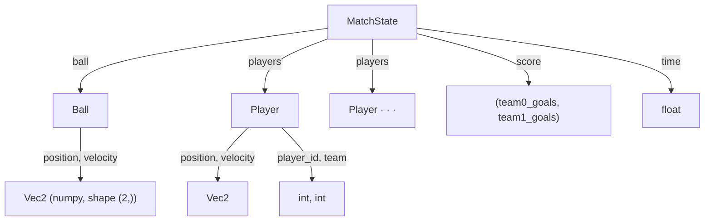
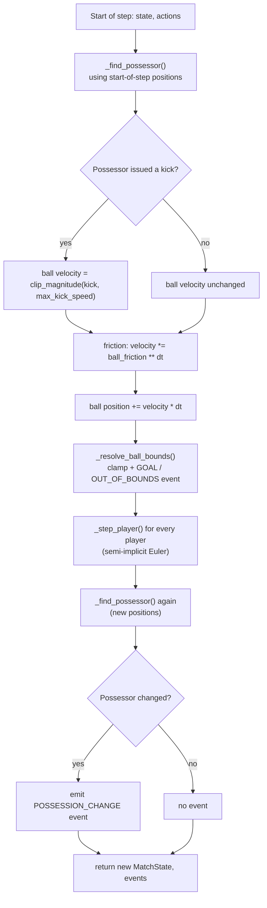

# Stage 1 — Physics Kernel: Concepts & Implementation

This doc explains the *physics kernel* (`soccersim/physics/`) at two levels:

- **Part 1 — Concepts**: what each rule/idea is and why it exists, with no code. Read this to understand the simulation as a soccer simulation, independent of Python.
- **Part 2 — Implementation**: how each concept above is actually written in `physics/`, including the algorithms, the math, and the trade-offs made along the way.

For the *decision log* (what was chosen and why, at the level of "which option did we pick") see [stage1.md](stage1.md). This doc is the "how does it actually work" companion to that.

---

## Part 1 — Concepts

### 1. A simulation is a "state" plus a "step function"

At its core, this whole project is one idea repeated everywhere: a **state** (a snapshot of everything at one instant — where's the ball, where are the players, what's the score) and a **step function** that takes a state plus some inputs and produces the *next* state, one small time-slice (`dt`, e.g. 1/60th of a second) at a time.

```
state(t) ──step(actions)──▶ state(t + dt)
```

Run `step` over and over and you get a whole match. This is exactly the same pattern used by Gymnasium/RL environments (`reset()` + `step()`), which is why building it this way now sets up Stage 4 (the RL environment wrapper) for free.

### 2. The pitch and coordinate system

The pitch is a rectangle, centered on `(0, 0)`:

```
 y=+width/2 ┌───────────────────────────────────────────────────┐
            │                                                     │
            │                                                     │
  Team 0    │                                                     │   Team 1
  goal ─────┤                        (0, 0)                       ├───── goal
  line      │                          ●                          │      line
            │                                                     │
            │                                                     │
 y=-width/2 └───────────────────────────────────────────────────┘
          x = -length/2                                    x = +length/2

  Team 0 defends x=-length/2, attacks toward +x  ── ▶
  Team 1 defends x=+length/2, attacks toward -x  ◀ ──
  Each goal mouth: |y| ≤ goal_width/2, at its team's goal line
```

Putting the origin at the center (rather than, say, a corner) means team 1's rules are always "team 0's rules, mirrored in x" — useful once scripted agents (Stage 3) need to treat both teams the same way.

### 3. Kinematics: velocity, acceleration, and speed limits

Players don't teleport — they have a **velocity** (how fast, and in what direction, they're currently moving) and they change that velocity by applying **acceleration** (how hard they're pushing, and in which direction). Both are capped:

- **Max acceleration** models how hard a player can push off the ground per instant (like a 0-to-top-speed sprint having a limit).
- **Max speed** models a player's top running speed.

Both limits are applied to the *vector* magnitude (its length), not to each axis independently — so a player's top speed is the same in every direction, not artificially faster running diagonally.

### 4. Friction: why the ball slows down

A rolling ball loses speed to friction with the grass. We model this as **exponential decay**: the ball loses a fixed *fraction* of its speed per second, so it slows down quickly at first and more gradually later — matching the intuition that a fast-rolling ball decelerates more noticeably than a slow-rolling one, without ever mathematically reaching exactly zero (it just gets negligibly close).

### 5. Possession and kicking

A player is **in possession** of the ball if they're the nearest player within a small radius of it. Only the player in possession can affect the ball on a given instant — everyone else's attempted kick simply doesn't connect. This is a deliberately simple stand-in for "you have to actually be near the ball to kick it."

A **kick** is modeled as the player instantly imparting a new velocity to the ball (up to some max kick speed) — like a strike, rather than a gentle push.

### 6. Boundaries, goals, and events

Two things can happen when the ball reaches the edge of the pitch:

- It crosses a goal line *inside* the goal mouth → **goal scored**.
- It crosses any other boundary (a touchline, or a goal line outside the goal mouth) → **out of bounds**.

Since there's no throw-in/corner/kickoff logic yet, the ball is simply stopped at whichever boundary it reached. Rather than silently mutating the score or position, the simulation reports these as **events** — a list of "here's what notable things happened this step," decoupled from the state itself. That separation matters later: a renderer, a training script, and a stats tracker can each react to events without needing to diff two states to figure out what changed.

### 7. Determinism: why the same inputs must always give the same outputs

If you run the exact same match (same starting position, same sequence of player actions) twice, you must get the exact same result both times — no hidden randomness, no dependence on wall-clock time, no dependence on incidental ordering (like which order players happen to be listed in). Determinism is what makes a "replay" file meaningful, what makes regression tests possible ("this exact scenario used to produce this exact result — does it still?"), and it's a prerequisite for reproducible RL experiments later on.

---

## Part 2 — Implementation

### 1. Data model

State is a small tree of Python dataclasses (`physics/state.py`), not one flat array — chosen for readability while these rules are still being designed (see [stage1.md](stage1.md) for the trade-off against a numpy-array-based state).



`Vec2` (`physics/vector.py`) is just a numpy array of shape `(2,)` — not a custom class — so `+`, `-`, scalar `*`, and `np.linalg.norm` all work directly on positions/velocities. The one shared helper worth knowing is `clip_magnitude(v, max_magnitude)`, used for *every* limit in the kernel (max acceleration, max speed, max kick speed): it scales a vector down to a maximum length while preserving its direction, which is how "cap the speed, not each axis" (Concept 3) is actually enforced.

### 2. The `step()` pipeline

`step(state, actions, config)` (`physics/step.py`) runs these stages in order:



A few things about this ordering are deliberate, not incidental:

- **Possession is judged at the *start* of the step**, before anything moves. A kick this step is judged by "was this player actually close enough a moment ago," not by where the ball ends up after moving — otherwise a fast-moving ball could be "kicked" by a player it only grazes past.
- **The ball is fully resolved (kick → friction → move → bounds) before any player moves.** Since `step()` only needs one possessor's action to affect the ball, this ordering is safe and keeps the ball's logic self-contained.
- **Possession is checked again at the end**, using the *new* ball/player positions, and compared against the possessor from the start of the step — a change between those two is what triggers `POSSESSION_CHANGE`. This means the very first `step()` call on a freshly-built match state won't itself produce a change event (there's no "previous" step to compare against) — only genuine within-step transitions do.

### 3. Player integration: semi-implicit Euler

`_step_player()` updates one player like this:

```
accel    = clip_magnitude(requested_accel, max_accel)
velocity = clip_magnitude(velocity + accel * dt, max_speed)
position = position + velocity * dt
```

The key detail: position is updated using the **already-updated** velocity, not the velocity from the start of the step. This one-line choice is the difference between "semi-implicit" (a.k.a. "symplectic") Euler and plain ("explicit") Euler integration. Explicit Euler — using the *old* velocity to move the position — tends to add energy and drift outward on curved motion; semi-implicit Euler is markedly more stable for exactly this "accelerate, then move" pattern, which is why it's the standard choice in game physics engines.

### 4. Ball integration: friction as an exact, dt-invariant closed form

The friction step is `velocity *= ball_friction ** dt`. The goal: friction should be a property of *time elapsed*, not of how finely that time happens to be sliced into steps. A quantity that loses a constant *fraction* of itself per second follows `v(t) = v0 * r**t` for some rate `r` (`config.ball_friction`, "fraction of speed retained per second"). Because of the exponent identity

```
(r ** dt) ** n  ==  r ** (dt * n)
```

multiplying velocity by `r ** dt` every step, `n` times, is **exactly** equal to multiplying by `r ** t` once (where `t = n * dt`) — not an approximation, an algebraic identity. That's why `tests/test_physics_invariants.py::test_ball_friction_matches_exact_exponential_decay` can assert near-exact equality against the closed form, rather than needing a loose tolerance: the discretization introduces *zero* error for velocity, regardless of `dt`.

Position (`position += velocity * dt`), by contrast, is only an *approximation* of the true integral of a time-varying velocity — it converges to the exact answer as `dt → 0`, but isn't exact at any finite `dt`. `test_ball_stopping_distance_matches_closed_form_integral` checks it against the closed-form integral of `v0 * r**t` using a small `dt` and a tolerance, rather than exact equality — because at finite `dt` there genuinely is a small discretization error. Noticing *which* parts of a simulation are exact vs. approximate at a given step size is a useful numerical-methods habit, and this kernel happens to have one clean example of each.

### 5. Boundary and goal resolution

`_resolve_ball_bounds()` checks both axes and always clamps the ball's position into the pitch rectangle on *both* — even if only one axis is used to decide which event to report. This matters at a large `dt`: a single big step can push the ball out of bounds on *both* x and y simultaneously (imagine the ball is near a corner of the pitch and moving diagonally fast). Clamping only the axis that "caused" the reported event would leave the ball outside the rectangle on the other axis. (This exact bug was caught by the `hypothesis` property test `test_ball_state_stays_finite_and_in_bounds_at_high_dt` during development — see the commit history for Stage 1.) When both axes are out simultaneously, the x-axis (goal line) takes priority for *which* event gets reported — an intentionally simple tie-break, not a physically precise treatment of pitch corners.

### 6. Possession tie-breaking

`_find_possessor()` finds the nearest player within `possession_radius`, breaking ties (equal distance) by lowest `player_id`. The specific rule doesn't matter much on its own — what matters is that it's *fixed* and never depends on incidental ordering (e.g. iteration order of a dict or list), which is what keeps `step()` deterministic (Concept 7) even in the rare case of an exact distance tie.

### 7. Testing strategy in practice

Two complementary styles, both in `tests/test_physics_invariants.py`:

| Style | What it does | Example |
|---|---|---|
| **Analytical** | Derive the exact expected answer by hand, check one specific scenario against it | `test_player_reaches_and_stays_clamped_at_max_speed`: under constant full-throttle input, speed must hit *exactly* `max_speed` (via clamping) |
| **Property-based** (`hypothesis`) | Assert something that must hold for *any* input in a range; let `hypothesis` search for a counterexample | `test_ball_state_stays_finite_and_in_bounds_at_high_dt`: for any velocity and any `dt` up to 2.0 seconds, the ball must stay finite and inside the pitch |

Property-based tests are particularly good at surfacing edge cases a human wouldn't think to write by hand — as happened with the corner-clamping bug above.

---

## Where to look in the code

| Concept | File | Key function(s) |
|---|---|---|
| State shape, coordinate system | `physics/state.py` | `Ball`, `Player`, `MatchState` |
| Vector math / limit clamping | `physics/vector.py` | `clip_magnitude`, `magnitude` |
| The step pipeline | `physics/step.py` | `step()` |
| Player motion | `physics/step.py` | `_step_player()` |
| Ball friction + movement | `physics/step.py` | `step()` (ball section) |
| Boundaries / goals | `physics/step.py` | `_resolve_ball_bounds()`, `_clamp_to_pitch()` |
| Possession / kicking | `physics/step.py` | `_find_possessor()` |
| Events | `physics/events.py` | `EventType`, `Event` |
| Kickoff / initial state | `physics/reset.py` | `build_kickoff_state()` |
| Correctness tests | `tests/test_physics_invariants.py`, `tests/test_reset.py` | — |
