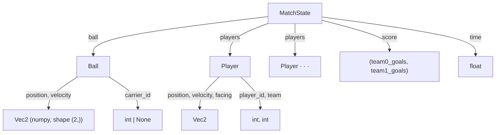
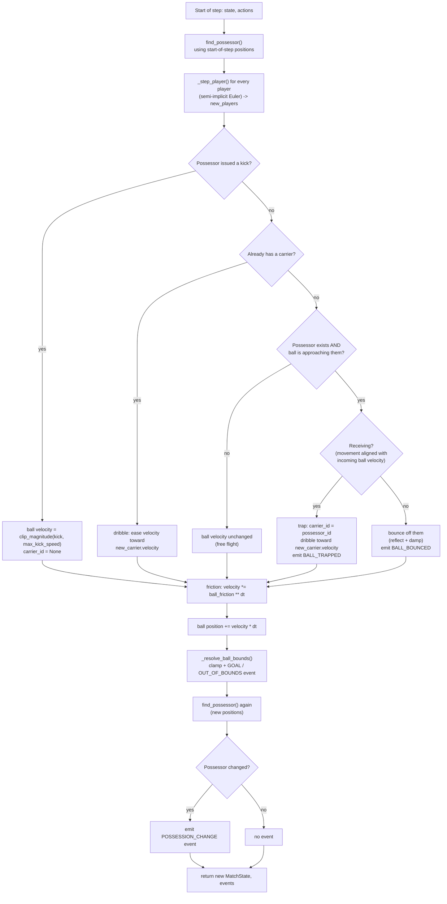

# Stage 1 — Physics Kernel: Concepts & Implementation

This doc explains the *physics kernel* (`soccersim/physics/`) at two levels:

- **Part 1 — Concepts**: what each rule/idea is and why it exists, with no code. Read this to understand the simulation as a soccer simulation, independent of Python.
- **Part 2 — Implementation**: how each concept above is actually written in `physics/`, including the algorithms, the math, and the trade-offs made along the way.

For the *decision log* (what was chosen and why, at the level of "which option did we pick") see [stage1.md](stage1.md). This doc is the "how does it actually work" companion to that.

---

## Part 1 — Concepts

### 1. A simulation is a "state" plus a "step function"

At its core, this whole project is one idea repeated everywhere: a **state** (a snapshot of everything at one instant — where's the ball, where are the players, what's the score) and a **step function** that takes a state plus some inputs and produces the *next* state, one small time-slice (`dt`, e.g. 1/60th of a second) at a time.

```
state(t) ──step(actions)──▶ state(t + dt)
```

Run `step` over and over and you get a whole match. This is exactly the same pattern used by Gymnasium/RL environments (`reset()` + `step()`), which is why building it this way now sets up Stage 4 (the RL environment wrapper) for free.

### 2. The pitch and coordinate system

The pitch is a rectangle, centered on `(0, 0)`:

```
 y=+width/2 ┌───────────────────────────────────────────────────┐
            │                                                     │
            │                                                     │
  Team 0    │                                                     │   Team 1
  goal ─────┤                        (0, 0)                       ├───── goal
  line      │                          ●                          │      line
            │                                                     │
            │                                                     │
 y=-width/2 └───────────────────────────────────────────────────┘
          x = -length/2                                    x = +length/2

  Team 0 defends x=-length/2, attacks toward +x  ── ▶
  Team 1 defends x=+length/2, attacks toward -x  ◀ ──
  Each goal mouth: |y| ≤ goal_width/2, at its team's goal line
```

Putting the origin at the center (rather than, say, a corner) means team 1's rules are always "team 0's rules, mirrored in x" — useful once scripted agents (Stage 3) need to treat both teams the same way.

### 3. Kinematics: velocity, acceleration, and speed limits

Players don't teleport — they have a **velocity** (how fast, and in what direction, they're currently moving) and they change that velocity by applying **acceleration** (how hard they're pushing, and in which direction). Both are capped:

- **Max acceleration** models how hard a player can push off the ground per instant (like a 0-to-top-speed sprint having a limit).
- **Max speed** models a player's top running speed.

Both limits are applied to the *vector* magnitude (its length), not to each axis independently — so a player's top speed is the same in every direction, not artificially faster running diagonally.

**Addendum: braking is quicker than accelerating.** A single acceleration limit made changing direction feel sluggish — reversing from top speed took nearly three real seconds. Real movement (and most sports games) isn't symmetric like that: digging in to stop or cut back uses your weight and studs against the ground differently than building up speed from a standing start does, so it happens faster. The kernel now has *two* acceleration limits: the lower one (`player_max_accel`) applies when speeding up — including from a standstill — and a higher one (`player_brake_accel`) applies specifically when the requested direction opposes the player's current velocity (braking or reversing).

### 4. Friction: why the ball slows down

A rolling ball loses speed to friction with the grass. We model this as **exponential decay**: the ball loses a fixed *fraction* of its speed per second, so it slows down quickly at first and more gradually later — matching the intuition that a fast-rolling ball decelerates more noticeably than a slow-rolling one, without ever mathematically reaching exactly zero (it just gets negligibly close).

### 5. Possession, carrying, and contact

A player is **in possession** of the ball if they're the nearest player within a small radius of it. This is a purely geometric, moment-to-moment fact — "who's closest right now" — and it's what decides whose kick, if any, gets to affect the ball this instant. Everyone else's attempted kick simply doesn't connect: a deliberately simple stand-in for "you have to actually be near the ball to touch it."

A **kick** is modeled as the player instantly imparting a new velocity to the ball (up to some max kick speed) — like a strike, rather than a gentle push. A kick always takes priority over everything below: a one-touch shot or pass doesn't require having first brought the ball under control.

**Carrying (dribbling) is a different, longer-lived idea.** Possession answers "who's closest," but it doesn't by itself make the ball actually *go with* a player as they run — without more rules, a ball just keeps obeying its own momentum and friction regardless of who's standing next to it. So when a loose ball reaches a player, one of two things happens, depending on *how* they meet it:

- **Trap.** If the player is moving roughly the *same way* the ball is already traveling — stepping back with it, cushioning its momentum, the way you'd actually receive a firm pass — they bring it under control. From then on, the ball rides along with them: it becomes theirs to carry until they kick it away.
- **Bounce.** If they're not moving to meet it that way (standing still, or moving to intercept rather than cushion), the ball just deflects off them like hitting an obstacle, losing some speed but staying loose — nobody's carrying it.

A ball that's already nearly stopped (sitting dead, e.g. right after kickoff) is always treated as receivable — there's no momentum to cushion, so anyone nearby can just walk up and gather it, no particular movement required. And a ball that's already moving *away* from a nearby player (for instance, right after it just bounced off them) doesn't repeatedly re-trigger this decision — contact is only resolved against a player the ball is actually heading toward.

### 6. Facing

Every player has a **facing direction** — a persistent sense of "which way they're oriented" — which tracks the last direction they were actually trying to move in, and holds steady once they stop pushing any direction (rather than snapping back to some default the instant they stand still). This matters for **aiming a kick**: rather than a kick always being pointed at a fixed target (e.g. "always toward the opponent's goal"), it fires in whatever direction the player is currently facing, at a strength the player controls — the same idea a scripted or learned agent (Stage 3+) can use too, not just a human at the keyboard.

### 7. Boundaries, goals, and events

Two things can happen when the ball reaches the edge of the pitch:

- It crosses a goal line *inside* the goal mouth → **goal scored**.
- It crosses any other boundary (a touchline, or a goal line outside the goal mouth) → **out of bounds**.

The simulation reports these as **events** — a list of "here's what notable things happened this step," decoupled from the state itself — rather than silently mutating the score or position. That separation matters later: a renderer, a training script, and a stats tracker can each react to events without needing to diff two states to figure out what changed.

`step()` itself always just stops the ball at whichever boundary it reached, no matter which event fired. **Restarting play after a goal** — putting the ball and every player back in kickoff formation — is a separate, explicit action a caller takes in response to seeing a `GOAL` event, not something baked into `step()`. Restarting after going out of bounds elsewhere (a throw-in or corner) is a different, still-deferred piece of logic — same category of fix, just not built yet, since it needs a different reset position (where the ball went out) rather than always kickoff.

### 8. Determinism: why the same inputs must always give the same outputs

If you run the exact same match (same starting position, same sequence of player actions) twice, you must get the exact same result both times — no hidden randomness, no dependence on wall-clock time, no dependence on incidental ordering (like which order players happen to be listed in). Determinism is what makes a "replay" file meaningful, what makes regression tests possible ("this exact scenario used to produce this exact result — does it still?"), and it's a prerequisite for reproducible RL experiments later on.

---

## Part 2 — Implementation

### 1. Data model

State is a small tree of Python dataclasses (`physics/state.py`), not one flat array — chosen for readability while these rules are still being designed (see [stage1.md](stage1.md) for the trade-off against a numpy-array-based state).



`Ball.carrier_id` and `Player.facing` are the two additions on top of Stage 1's original shape (see "Ball carrying" and "Facing" below) — both are genuine *persistent* state, unlike `possessor_id`, which is recomputed fresh every step from positions alone and never stored.

`Vec2` (`physics/vector.py`) is just a numpy array of shape `(2,)` — not a custom class — so `+`, `-`, scalar `*`, and `np.linalg.norm` all work directly on positions/velocities. The one shared helper worth knowing is `clip_magnitude(v, max_magnitude)`, used for *every* limit in the kernel (max acceleration, max speed, max kick speed): it scales a vector down to a maximum length while preserving its direction, which is how "cap the speed, not each axis" (Concept 3) is actually enforced.

### 2. The `step()` pipeline

`step(state, actions, config)` (`physics/step.py`) runs these stages in order:



A few things about this ordering are deliberate, not incidental:

- **Possession/contact is judged at the *start* of the step**, before anything moves. A kick, trap, or bounce this step is judged by "was this player actually close enough (and approaching, for contact) a moment ago," not by where the ball ends up after moving — otherwise a fast-moving ball could be "kicked" (or trapped) by a player it only grazes past.
- **Players are advanced first**, before the ball's fate is decided, specifically so a dribble target can use a carrier's *just-updated* velocity for this step rather than their velocity from before it moved — otherwise the ball would always trail one step behind a still-accelerating carrier. Player motion never depends on the ball, so reordering this way changes nothing about how players move.
- **A kick always wins**, overriding both carrying and bouncing — see "Ball carrying" below.
- **Possession is checked again at the end**, using the *new* ball/player positions, and compared against the possessor from the start of the step — a change between those two is what triggers `POSSESSION_CHANGE`. This means the very first `step()` call on a freshly-built match state won't itself produce a change event (there's no "previous" step to compare against) — only genuine within-step transitions do. Note this is entirely independent of `carrier_id`: a player can stay the ball's carrier across many steps without `POSSESSION_CHANGE` firing again, since that event only tracks the geometric "nearest player" fact.

### 3. Player integration: semi-implicit Euler

`_step_player()` updates one player like this:

```
accel_limit = player_brake_accel if opposing_current_velocity else player_max_accel
accel        = clip_magnitude(requested_accel, accel_limit)
velocity     = clip_magnitude(velocity + accel * dt, max_speed)
position     = position + velocity * dt
```

`opposing_current_velocity` is `dot(requested_accel, velocity) < 0` while the player is actually moving — i.e. the requested direction has a *negative* component along the current velocity, so it's working against the current motion rather than with it. From a standstill (`velocity` is zero) there's nothing to oppose, so accelerating from rest always uses the lower `player_max_accel`, same as any other non-opposing request. See §8 for why this asymmetry exists.

The key detail in the middle line: position is updated using the **already-updated** velocity, not the velocity from the start of the step. This one-line choice is the difference between "semi-implicit" (a.k.a. "symplectic") Euler and plain ("explicit") Euler integration. Explicit Euler — using the *old* velocity to move the position — tends to add energy and drift outward on curved motion; semi-implicit Euler is markedly more stable for exactly this "accelerate, then move" pattern, which is why it's the standard choice in game physics engines.

### 4. Ball integration: friction as an exact, dt-invariant closed form

The friction step is `velocity *= ball_friction ** dt`. The goal: friction should be a property of *time elapsed*, not of how finely that time happens to be sliced into steps. A quantity that loses a constant *fraction* of itself per second follows `v(t) = v0 * r**t` for some rate `r` (`config.ball_friction`, "fraction of speed retained per second"). Because of the exponent identity

```
(r ** dt) ** n  ==  r ** (dt * n)
```

multiplying velocity by `r ** dt` every step, `n` times, is **exactly** equal to multiplying by `r ** t` once (where `t = n * dt`) — not an approximation, an algebraic identity. That's why `tests/test_physics_invariants.py::test_ball_friction_matches_exact_exponential_decay` can assert near-exact equality against the closed form, rather than needing a loose tolerance: the discretization introduces *zero* error for velocity, regardless of `dt`.

Position (`position += velocity * dt`), by contrast, is only an *approximation* of the true integral of a time-varying velocity — it converges to the exact answer as `dt → 0`, but isn't exact at any finite `dt`. `test_ball_stopping_distance_matches_closed_form_integral` checks it against the closed-form integral of `v0 * r**t` using a small `dt` and a tolerance, rather than exact equality — because at finite `dt` there genuinely is a small discretization error. Noticing *which* parts of a simulation are exact vs. approximate at a given step size is a useful numerical-methods habit, and this kernel happens to have one clean example of each.

### 5. Boundary and goal resolution

`_resolve_ball_bounds()` checks both axes and always clamps the ball's position into the pitch rectangle on *both* — even if only one axis is used to decide which event to report. This matters at a large `dt`: a single big step can push the ball out of bounds on *both* x and y simultaneously (imagine the ball is near a corner of the pitch and moving diagonally fast). Clamping only the axis that "caused" the reported event would leave the ball outside the rectangle on the other axis. (This exact bug was caught by the `hypothesis` property test `test_ball_state_stays_finite_and_in_bounds_at_high_dt` during development — see the commit history for Stage 1.) When both axes are out simultaneously, the x-axis (goal line) takes priority for *which* event gets reported — an intentionally simple tie-break, not a physically precise treatment of pitch corners.

**Restarting after a goal.** `physics/reset.py::restart_after_goal(state, config)` takes a `MatchState` and returns one with the ball and every player back in kickoff formation — but with `time` and `score` copied through unchanged from the input, unlike `build_kickoff_state()` (which always starts a fresh `0.0`/`(0, 0)`). Both share a private `_kickoff_positions(config)` helper so "what does kickoff formation look like" is defined exactly once. `step()` doesn't call this itself; a caller composes the two explicitly:

```python
state, events = step(state, actions, config)
if any(event.type is EventType.GOAL for event in events):
    state = restart_after_goal(state, config)
```

`scripts/run_match.py` does exactly this. Keeping the composition explicit (rather than, say, an optional flag on `step()`) means the existing goal-crossing test (`test_ball_crossing_goal_mouth_scores_and_updates_score`) keeps checking exactly what it says it checks — the ball stopped at the line, at the instant the goal is scored — while a separate test (`test_restart_after_goal_composes_with_step_to_relocate_the_ball`) checks the two-step composition callers actually use.

### 6. Possession tie-breaking

`find_possessor()` finds the nearest player within `possession_radius`, breaking ties (equal distance) by lowest `player_id`. The specific rule doesn't matter much on its own — what matters is that it's *fixed* and never depends on incidental ordering (e.g. iteration order of a dict or list), which is what keeps `step()` deterministic (Concept 7) even in the rare case of an exact distance tie.

### 7. Ball carrying: trap vs bounce

Three small pure functions in `physics/step.py` implement Concept 5 (Possession, carrying, and contact):

**`_is_approaching(ball_velocity, ball_position, player_position)`** — guards the whole thing. It's `True` if the ball's speed is near zero (a dead ball has no trajectory to check, so it's unconditionally "approaching"), or if `dot(ball_velocity, player_position - ball_position) > 0` — the ball's velocity has a positive component pointing toward the player, i.e. it's actually closing the distance rather than moving away or tangentially. Without this, a ball that had *already* bounced away would keep re-entering the trap/bounce decision on every subsequent step it happened to still be within `possession_radius`, repeatedly "bouncing" an already-receding ball. This was caught by manual testing, not a unit test — a reminder that hypothesis-style property tests only catch what you remember to assert.

**`_is_receiving(ball_velocity, action, threshold)`** — the trap/bounce decision itself, once contact is confirmed. Both the ball's velocity and the player's *requested* acceleration (`action.move`, their intent this step — not their resulting velocity) are reduced to unit vectors, and compared via cosine similarity (their dot product, since both have length 1): `1.0` means dead-on the same direction as the ball's flight, `0.0` is perpendicular, negative means moving to meet it head-on. A result at or above `receive_alignment_threshold` (default `0.3`, roughly "within ~70° of the ball's direction of travel") counts as a deliberate trap. As with approach, a near-zero-speed ball is unconditionally receivable — there's no momentum to cushion, so any nearby player can simply gather it regardless of what they're doing.

**`_dribble_velocity(ball_velocity, carrier_velocity, config)`** — how a carried ball's velocity is kept in sync with its carrier, once trapped:

```
velocity_error = carrier_velocity - ball_velocity
accel          = clip_magnitude(velocity_error / dt, dribble_accel)
new_velocity   = ball_velocity + accel * dt
```

This is the *exact same* accelerate-then-clip pattern `_step_player` uses for a player's own motion — just aimed at closing the gap to a target velocity instead of following a requested acceleration. `dribble_accel` (default `40.0`) is deliberately far larger than a player's own `player_max_accel` (`6.0`), so in practice the gap closes within a single step (any realistic velocity mismatch is well under the cap, so `accel` is rarely even clipped) — the ball looks glued to the carrier's feet, while still being a *continuous* function of state rather than a snap/teleport. Continuity matters here for the same reason it matters for `clip_magnitude` elsewhere: a discontinuous jump is harder to reason about, to test with tolerances, and — later — to hand to a learning algorithm as part of an observation.

**`_bounce_velocity(ball_velocity, ball_position, player_position, restitution)`** — the standard reflection formula for a collision against a surface of effectively infinite mass (a player's body doesn't move backward when a ball hits it):

```
normal        = normalize(ball_position - player_position)   # points away from the player, through the ball
normal_speed  = dot(ball_velocity, normal)
new_velocity  = ball_velocity - (1 + restitution) * normal_speed * normal      # only if normal_speed < 0
```

Only the velocity component *along the normal* is affected — reversed, and scaled down by `restitution` (`0.0` = fully absorbed, `1.0` = perfectly elastic; the default `0.4` sits well toward "absorbed," since a torso isn't a bouncy wall). The *tangential* component (everything perpendicular to the normal) passes through completely unchanged. That's what makes a dead-center hit bounce straight back, while an off-center graze deflects at an angle — the same geometry as a ball glancing off a wall.

All four functions above operate purely on vectors/config and have no side effects — the branching logic in `step()` itself (which one applies, when, and which `EventType` to emit) is what's actually shown in the §2 flowchart.

### 8. Asymmetric acceleration: braking vs accelerating

With a single acceleration cap, reversing direction at top speed (`player_max_speed=8`, `player_max_accel=6`) takes `2 * 8 / 6 ≈ 2.7` real seconds — noticeably sluggish for keyboard control. `_step_player` (§3) now picks between two caps: `player_max_accel` (`6.0`) whenever the requested acceleration isn't opposing the current velocity — including accelerating from a standstill — and the higher `player_brake_accel` (`14.0`) specifically when it is. This is a one-line `dot()` check, not a new integration scheme, and it composes with everything else in `_step_player` unchanged (the result is still clipped to `player_max_speed` exactly as before).

### 9. Facing

`Player.facing` (`physics/state.py`) is a unit `Vec2`, defaulting to `(1.0, 0.0)` and set explicitly per team at kickoff/restart (`physics/reset.py::_line_up` — team 0 faces `+x`, team 1 faces `-x`, matching which goal each team attacks). `_step_player` updates it every step:

```python
facing = normalize(requested_accel) if magnitude(requested_accel) > 0.0 else player.facing
```

i.e. "point wherever the player is currently trying to move; if they're not trying to move, keep pointing wherever they last were." This makes it a genuinely persistent piece of state (like `carrier_id`), not something recomputed from a single instant's velocity — a player who's just braking to a stop (velocity shrinking, but no new requested direction) keeps their prior facing rather than it becoming ill-defined at zero velocity. `scripts/run_match.py` uses it to aim a charge-and-release kick (see [stage2.md](stage2.md)); a future scripted or learned agent (Stage 3+) has the same field available for the same purpose.

### 10. Testing strategy in practice

Two complementary styles, both in `tests/test_physics_invariants.py`:

| Style | What it does | Example |
|---|---|---|
| **Analytical** | Derive the exact expected answer by hand, check one specific scenario against it | `test_player_reaches_and_stays_clamped_at_max_speed`: under constant full-throttle input, speed must hit *exactly* `max_speed` (via clamping) |
| **Property-based** (`hypothesis`) | Assert something that must hold for *any* input in a range; let `hypothesis` search for a counterexample | `test_ball_state_stays_finite_and_in_bounds_at_high_dt`: for any velocity and any `dt` up to 2.0 seconds, the ball must stay finite and inside the pitch |

Ball-contact behavior (trap, bounce, dribble persistence, kick-releases-carrier) has its own file, `tests/test_physics_ball_contact.py`, kept separate from `test_physics_invariants.py` since it's a distinct concern (contact resolution) rather than the core kinematics/friction/bounds invariants.

Property-based tests are particularly good at surfacing edge cases a human wouldn't think to write by hand — as happened with the corner-clamping bug above.

---

## Where to look in the code

| Concept | File | Key function(s) |
|---|---|---|
| State shape, coordinate system | `physics/state.py` | `Ball`, `Player`, `MatchState` |
| Vector math / limit clamping | `physics/vector.py` | `clip_magnitude`, `magnitude` |
| The step pipeline | `physics/step.py` | `step()` |
| Player motion | `physics/step.py` | `_step_player()` |
| Ball friction + movement | `physics/step.py` | `step()` (ball section) |
| Boundaries / goals | `physics/step.py` | `_resolve_ball_bounds()`, `_clamp_to_pitch()` |
| Possession / kicking | `physics/step.py` | `find_possessor()` |
| Ball carrying: contact gate | `physics/step.py` | `_is_approaching()` |
| Ball carrying: trap vs bounce decision | `physics/step.py` | `_is_receiving()` |
| Ball carrying: dribble pursuit | `physics/step.py` | `_dribble_velocity()` |
| Ball carrying: bounce reflection | `physics/step.py` | `_bounce_velocity()` |
| Asymmetric braking | `physics/step.py` | `_step_player()` |
| Facing | `physics/state.py`, `physics/step.py` | `Player.facing`, `_step_player()` |
| Events | `physics/events.py` | `EventType`, `Event` |
| Kickoff / initial state | `physics/reset.py` | `build_kickoff_state()` |
| Restart after a goal | `physics/reset.py` | `restart_after_goal()` |
| Correctness tests | `tests/test_physics_invariants.py`, `tests/test_physics_ball_contact.py`, `tests/test_reset.py` | — |
