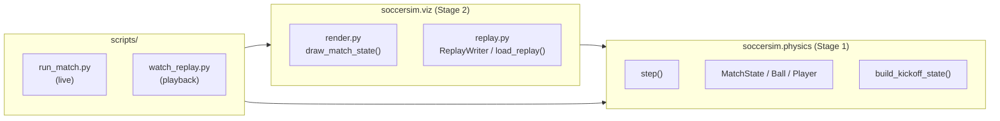
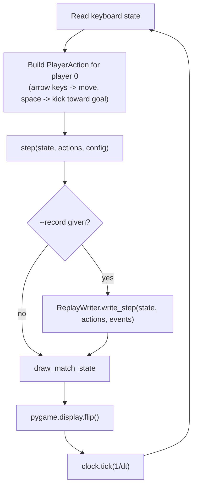
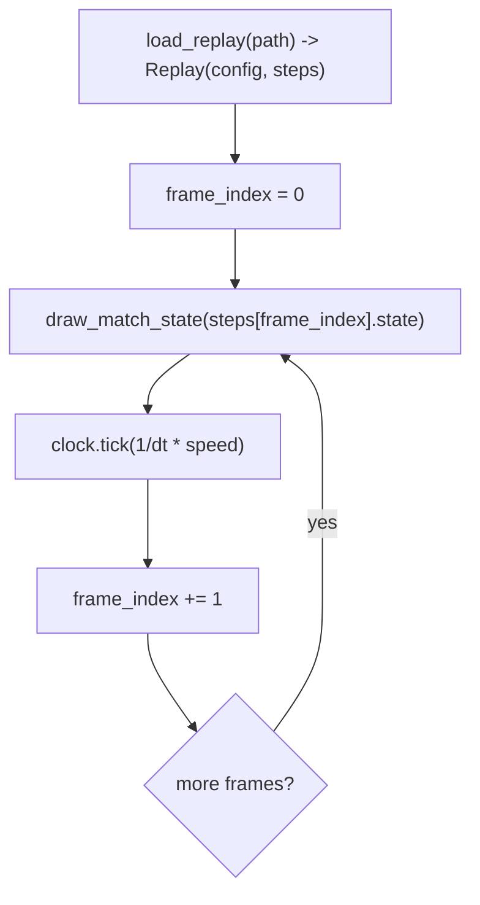

# Stage 2 concepts & implementation — Visualization & replay

Two levels, same as [stage1-concepts.md](stage1-concepts.md): **Part 1** is the "what and why" with no code (rendering/replay concepts that apply to any simulator, not just this one); **Part 2** is "how it's actually built" (the specific pygame/JSONL choices in this repo).

## Part 1 — Concepts

### Why visualize at all?

Stage 1 built a physics kernel you can only inspect through numbers — printing positions, reading test assertions. That's precise, but it's slow to build intuition with: "does the ball actually curve right after a kick?" is a five-second glance at a picture, and a much longer exercise reading floats in a debugger. A renderer's whole job is to turn `MatchState` into something a human can eyeball and immediately judge as "looks right" or "looks broken."

### The rendering pipeline: state -> pixels

A renderer is a pure translation step: given a snapshot of the world (`MatchState`) and some display configuration, produce pixels. Two things make this translation non-trivial:

1. **Different coordinate systems.** The physics world is measured in meters, origin at the center of the pitch, with `+y` pointing "up" in the normal mathematical sense. A screen is measured in pixels, origin at the top-left corner, with `+y` pointing *down* (because a display is drawn top row first — the "next" row as you scan down the image has a *larger* row index). Converting between the two means both a change of *scale* (meters → pixels) and a flip of one axis.
2. **Different sizes.** The pitch's physical dimensions (say, 105m × 68m) have nothing to do with how big a window should be on screen. A fixed "pixels per meter" ratio decouples the two — the renderer always knows how to map any pitch size to a sensible window size.

```
Screen (pixels, origin top-left, +y down)          World (meters, origin at center, +y up)
┌──────────────────────────────────┐                        +y
│ HUD:  0 - 0        t = 12.34s    │                         │
├──────────────────────────────────┤            -x ──────────┼────────── +x
│  ┌─┐                        ┌─┐  │                          │
│  │ │          ●             │ │  │  <-- goals               -y
│  └─┘          (ball)        └─┘  │
└──────────────────────────────────┘
```

### Real-time playback: pacing frames to wall-clock time

Stage 1's `step()` doesn't know or care how fast real time passes — it just advances the world by one `dt` per call, as many times as you call it. A *live* viewer, though, needs to call `step()` at roughly the same rate as real time elapses, or the match will visibly run in fast-motion or slow-motion. This is the classic game-loop pattern: advance the simulation by a fixed `dt`, draw the result, then wait (a "clock tick") just long enough that, on average, one loop iteration takes exactly `dt` of wall-clock time. A *replay* viewer follows the same pattern, except each "step" replays an already-computed frame instead of computing a new one — the pacing logic is identical either way.

### Replays: an exact, reusable trajectory

Because Stage 1's `step()` is deterministic (same pure inputs → same outputs, no hidden randomness), a recording of "every state, the action that produced it, and the events that fired" is a *complete* description of a match — there's nothing approximate or lossy about replaying it later; it's the exact same sequence of frames, not a re-simulation. That property is what makes a replay useful for more than just re-watching a match:

- **Debugging**: capture a match once, then step through the recorded frames as slowly as you like without re-running (possibly non-reproducible, if it depended on live keyboard input) gameplay.
- **Future training data**: Stages 6+ (imitation learning, RL logging) fundamentally want datasets of `(state, action, outcome)` — exactly the shape a replay already has. Building that shape now, while it's cheap and the format can still evolve, avoids redesigning it later under pressure from an actual training pipeline.

### Keeping the renderer decoupled from the simulation

The physics kernel (`physics/`) must never depend on the renderer (`viz/`) — only the other direction is allowed. This matters concretely once RL training (Stage 7+) needs to run thousands of matches per second with no display at all: as long as nothing in `physics/` imports pygame, a training script can import only `physics/` and never pay any cost (or dependency risk) for rendering code it doesn't use.

## Part 2 — Implementation

### Module structure and dependency direction



`physics` has no arrow pointing at `viz` — it doesn't know rendering or replay exist. Both scripts import `viz` and `physics` directly, but never the other way around.

### The live loop (`scripts/run_match.py`)



`clock.tick(1/dt)` is pygame's fixed-rate pacing primitive: it sleeps just long enough that, called once per loop iteration, iterations happen at roughly `1/dt` per second — which is exactly what "the sim's `dt` matches wall-clock time" means.

### The replay loop (`scripts/watch_replay.py`)

Same shape, minus the simulation step — it advances through an already-loaded list of `ReplayStep`s instead of calling `step()`:



The `--speed` multiplier just scales the tick rate — frames are still played back one at a time, in order, so a replay is always watched in the order it was recorded.

### The world → screen transform (`viz/render.world_to_screen`)

For a world position `(x, y)` in meters:

```
screen_x = MARGIN + (x + pitch_length/2) * PIXELS_PER_METER
screen_y = HUD_HEIGHT + MARGIN + (pitch_width/2 - y) * PIXELS_PER_METER
```

`x + pitch_length/2` shifts the world's `x` range from `[-L/2, L/2]` to `[0, L]` — i.e., moves the origin from pitch-center to pitch-left-edge — before scaling by pixels-per-meter and offsetting by the margin. `pitch_width/2 - y` does the same shift *and* the axis flip in one expression: when `y = pitch_width/2` (the "top" of the pitch in world terms) the result is `0` (the top of the screen); when `y = -pitch_width/2` (the "bottom" of the pitch) the result is `pitch_width` (further down the screen). Every other drawing helper (`_draw_pitch_markings`, `_draw_goals`, player/ball circles) calls this once per point and never touches world coordinates directly — see `viz/render.py`.

### Replay file schema (JSON Lines)

Every `.jsonl` replay file has this shape:

| Line | `kind` | Fields |
|---|---|---|
| 1 (always) | `"meta"` | `config`: the full `SimConfig`, as `dataclasses.asdict()` — pitch size, `dt`, friction, etc. |
| 2..N | `"step"` | `time`, `score`, `ball` (`position`/`velocity` as plain lists), `players` (list of `player_id`/`team`/`position`/`velocity`), `actions` (`{player_id: {move, kick}}`, `kick` possibly `null`), `events` (list of `{type, data}`) |

The first step record (index 0) is always the initial kickoff state with empty `actions`/`events` — recorded before any `step()` call — so a replay never starts mid-action. `numpy` arrays (`Vec2`) aren't JSON-serializable, so every array is converted to a plain Python list (`.tolist()`) on write and rebuilt with `vec2(*list)` on read; see the `_*_to_jsonable`/`_*_from_record` helper pairs in `viz/replay.py` for the exact conversions, one pair per data structure (`Ball`, `Player`, `PlayerAction`, `Event`).

`ReplayWriter` is a small stateful class (not a pure function) because writing is inherently sequential and stateful — it holds an open file handle across many `write_step()` calls, closed once via `close()` or a `with` block. `load_replay()`, by contrast, is a pure function: given a path, it always returns the same `Replay(config, steps)` for the same file contents.

### Testing approach

| Concern | Test | File |
|---|---|---|
| Replay round-trip is lossless (state, actions incl. `kick=None`, events, config) | `test_replay_round_trip_preserves_config_state_actions_and_events`, `test_replay_round_trip_preserves_none_kick_and_events` | `tests/test_viz_replay.py` |
| Renderer runs without a real display and actually paints something | `test_draw_match_state_runs_headlessly_and_paints_pitch_and_ball` | `tests/test_viz_render.py` |
| `world_to_screen` scaling/flip is directionally correct | `test_world_to_screen_maps_pitch_center_and_corner_consistently` | `tests/test_viz_render.py` |

Rendering tests set `SDL_VIDEODRIVER=dummy` (and `SDL_AUDIODRIVER=dummy`) so pygame never tries to open a real window — `pygame.draw`/`pygame.font` work identically against an off-screen `pygame.Surface`, which is what makes headless CI runs possible at all.

## Where to look in the code

| Concept | File / function |
|---|---|
| World → screen coordinate transform | `viz/render.py::world_to_screen` |
| Frame drawing (pitch, goals, players, ball, HUD) | `viz/render.py::draw_match_state` |
| Replay writer (JSONL, one meta line + N step lines) | `viz/replay.py::ReplayWriter` |
| Replay loader | `viz/replay.py::load_replay` |
| numpy ↔ JSON conversions | `viz/replay.py::_ball_to_jsonable` and siblings |
| Live viewer + keyboard debug control | `scripts/run_match.py` |
| Replay viewer | `scripts/watch_replay.py` |
