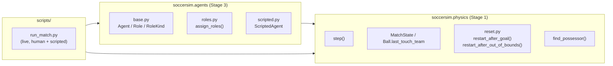
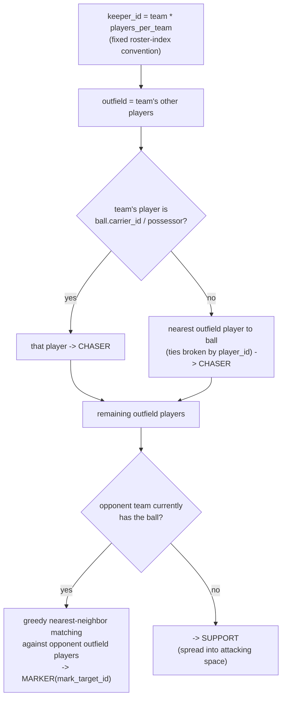
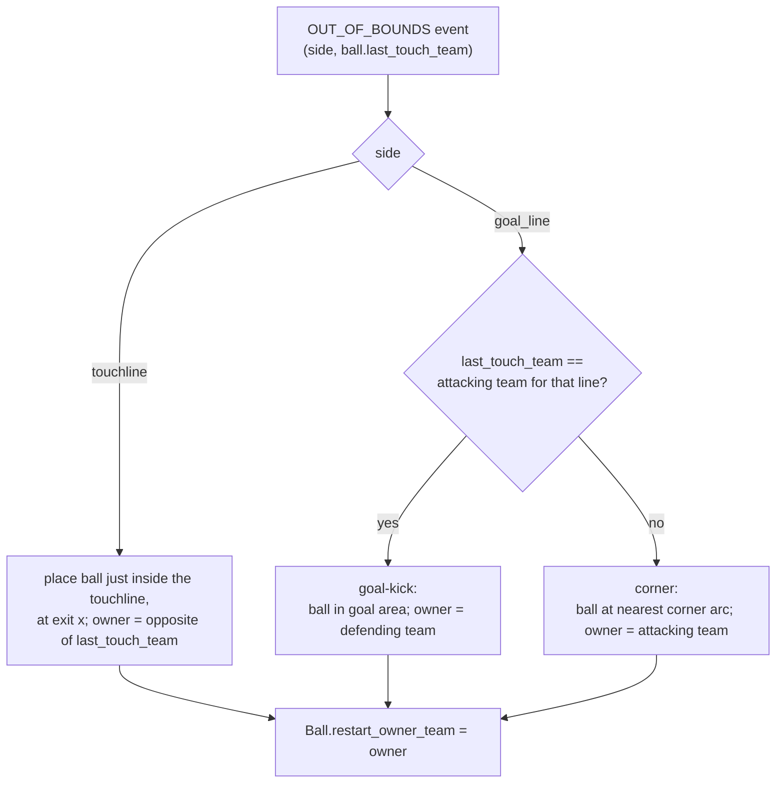

# Stage 3 concepts & implementation — Baseline scripted AI

Two levels, same as [stage1-concepts.md](stage1-concepts.md): **Part 1** is the "what and why" with no code (agent architecture and team-shape concepts that apply to any multi-agent simulator, not just this one); **Part 2** is "how it's actually built" (the specific classes/modules in this repo).

## Part 1 — Concepts

### Why an `Agent` interface at all?

Every stage from here on (scripted heuristics, behavior cloning, single-agent RL, multi-agent RL) is really the same question asked with a different tool: "given what one player can see, what should they do this instant?" If every one of those approaches has to slot into the *same* shape — `act(observation) -> action` — then swapping a scripted defender for a trained neural-network defender is a one-line change in whichever script builds the roster, not a rewrite of the match loop, the renderer, or the replay format. That's the entire point of defining `Agent` now, before any ML exists: it's the seam every future stage plugs into.

The interface is deliberately **per-player**, not per-team. A team-level "one brain controls all five players" interface would make coordination trivial to write today, but it's the wrong shape for where this is going: Stage 6 clones *one player's* behavior from data, Stage 7 trains *one player's* policy with RL. Keeping `Agent` single-player-shaped now means those stages plug in a learned agent for one roster slot without redesigning anything.

### The coordination problem: simple parts, sensible whole

A single player, deciding alone from what they can see, can't produce good *team* shape by itself — nothing stops all five players from independently deciding "the ball is loose, I should chase it," leaving the defense empty. Team sports scripted AI (and, later, multi-agent RL) universally solves this with some layer *above* individual decision-making that assigns **roles**: exactly one chaser, some markers each tied to a specific opponent, one keeper anchored at goal. Roles turn a "what should I do" question every player answers independently and inconsistently into a "what's my job" question the team answers *jointly and consistently* once per instant, which every player then executes on their own.

This is a real, general trade-off: fully decentralized decision-making (every agent purely reactive, no shared coordination step) is simpler and more "pure," but can produce structurally silly behavior (two defenders on one attacker, nobody on the striker) unless every agent happens to compute *identical* answers to "who's covering whom" from the same shared information — which breaks down the moment the assignment needs to be a genuine one-to-one *matching* rather than each agent's independent nearest-neighbor guess. A small, explicit, once-per-step coordination pass (assign roles, *then* let each agent act on its role) buys correctness at the cost of one extra shared computation — a good trade at this scale, and one worth recognizing as a recurring pattern (it shows up again, in more sophisticated form, whenever Stage 5's tactics layer or Stage 8's multi-agent training need teammates to behave coherently as a unit).

### Assignment as a matching problem

"Which defender marks which attacker" is a classic **assignment problem**: given a set of defenders and a set of attackers, pair them up to minimize total distance (or some other cost), with no attacker double-covered and no defender double-assigned unless rosters are uneven. The mathematically optimal solution (the Hungarian algorithm) minimizes *total* cost across every pair simultaneously; a much simpler **greedy** approximation — repeatedly pick the single closest remaining (defender, attacker) pair, remove both from the pool, repeat — doesn't guarantee the global optimum, but it does guarantee the property that actually matters here: no two defenders end up covering the same attacker while another goes completely unmarked. That property, not perfect optimality, is what makes team shape look sane, and it's cheap enough to recompute from scratch every single step (no need to track assignments across frames, which sidesteps a whole separate question of *when* to reassign).

### Passing as a geometry problem, not a threshold

A tempting first cut at "is teammate X open for a pass" is a distance rule: "open if no opponent is within N meters of them." This is exactly the kind of arbitrary-threshold mechanic worth avoiding when a more mechanistic alternative exists — an opponent standing 3 meters from X but *behind* them, with no way to reach the ball's flight path, isn't actually a threat to the pass; an opponent 6 meters away but sitting squarely *on* the line between passer and receiver is. The geometrically honest question is "how close does the *nearest opponent* get to the *straight line the pass would travel*" — i.e., point-to-line-segment distance, minimized over every opponent. Maximizing that quantity across candidate receivers picks the actually-clearest lane, not just the actually-farthest teammate.

### Restarts and "who touched it last"

Real football's throw-in/corner/goal-kick rules all hinge on one fact: which team's player last made contact with the ball before it left the field. That's not something you can recover from a single frozen `MatchState` — it's a piece of *history* (what happened on the most recent contact), so it has to be tracked forward through time as the simulation runs, the same way `Ball.carrier_id` already is. Once that's tracked, "which restart applies" collapses to simple geometry: which boundary the ball crossed, and whether the team that touched it last was attacking or defending that line.

## Part 2 — Implementation

### Module structure and dependency direction



`physics` still has no arrow pointing at `agents` — the one-way dependency rule from ROADMAP.md holds exactly as it did for `viz` in Stage 2. `agents` only *reads* `MatchState`/`SimConfig` and calls the newly-public `find_possessor()`; it never reaches back into `physics` internals.

### The `Agent` interface (`agents/base.py`)

```python
class RoleKind(enum.Enum):
    KEEPER = "keeper"
    CHASER = "chaser"
    MARKER = "marker"
    SUPPORT = "support"

@dataclasses.dataclass
class Role:
    kind: RoleKind
    mark_target_id: int | None = None  # only meaningful for MARKER

class Agent(Protocol):
    def act(self, player_id: int, state: MatchState, role: Role, config: SimConfig) -> PlayerAction: ...
```

`Agent` is a `typing.Protocol`, not an ABC — any object with a matching `act()` method (a scripted heuristic, later a thin wrapper around a trained PyTorch policy) satisfies it structurally, with no forced inheritance. `Role` is what the per-team coordination pass (below) hands to each agent alongside the raw `MatchState`; it's the *only* thing the interface adds on top of "here's the world, here's who you are."

### Per-step role assignment (`agents/roles.py::assign_roles`)

Runs once per team, twice per `step()` call (each team computed independently — team 1's assignment never looks at team 0's roles, only at raw positions, which keeps it symmetric and side-agnostic):



The greedy matching (`_assign_markers`) repeatedly finds the single closest remaining `(defender, opponent)` pair across the whole remaining pool, assigns it, and removes both from further consideration — see Part 1's "Assignment as a matching problem." Distance ties are broken by `(defender_id, opponent_id)` throughout, preserving `step()`'s determinism guarantee: `assign_roles` is a pure function of `(state, config)`, so it's exactly as reproducible as everything it feeds into.

`find_possessor()` (promoted from a `step.py`-private helper to a small shared function both `step()` and `assign_roles()` call) is what answers "does my team have the ball" — it's the same possession-radius/nearest-player logic `step()` already used to decide whose kick affects the ball, reused here rather than reimplemented, so "who's in possession" can never disagree between the physics kernel and the role layer.

### Scripted behaviors (`agents/scripted.py::ScriptedAgent`)

One stateless class, dispatching purely on `role.kind` — there's no per-player memory between steps; every decision is recomputed fresh from the current `MatchState`, same as `step()` itself:

- **KEEPER**: stays anchored near the own goal line; tracks the ball's `y` position, clamped to within the goal mouth, so it shifts side-to-side to cover whichever half of the goal the ball threatens. Comes further off the line only when the ball is within a short danger radius directly in front of goal.
- **CHASER**, not currently carrying the ball: accelerates toward the ball's current position.
- **CHASER**, currently carrying the ball (`state.ball.carrier_id == player_id`): evaluates, in order —
  1. **Shoot** if within shooting range and the lane to goal is reasonably clear — aims at whichever point along the goal mouth is farthest from the keeper's current `y` (see Part 1's passing-lane reasoning; the same "maximize clearance" idea applied to the goal mouth instead of a teammate).
  2. **Pass** to whichever teammate maximizes passing-lane clearance (`_best_passing_lane`: minimum opponent-to-segment distance, maximized over candidate receivers), if that clearance beats a "just dribble forward" baseline.
  3. **Dribble**: otherwise, just move (no kick) toward goal — carrying physics (`step.py`'s `_dribble_velocity`) keeps the ball attached automatically as long as the carrier keeps moving, so "dribble" needs no special-cased kick at all.
- **MARKER**: moves to a goal-side point near `role.mark_target_id` — offset from the marked opponent's position, toward this team's own goal — rather than moving directly onto the ball or the opponent themselves.
- **SUPPORT**: moves into open space biased toward the attacking half, giving the ball-carrier a passing option without crowding them.

Every one of those roles ultimately reduces to "move toward this target point," handled by one shared helper, `_move_toward` — worth its own note, since its first version had a real bug. Requesting full `player_max_accel` straight at the target with no slowdown works fine while far away, but once a player is close enough to *reach* a genuinely fixed target (the keeper's spot, a marker's shadow position, a support anchor) at max speed, there's nothing to stop them blasting straight through it — they'd overshoot, get hard-braked once their direction reversed, overshoot the other way, and settle into a slow, decaying oscillation around the point instead of arriving at it (reported directly from watching a match: a visibly "pendulum"-like swing). The fix is the standard **arrival steering behavior**: cap the desired approach speed at `sqrt(2 * player_brake_accel * distance)` — the same kinematic relation used to compute real stopping distances — so the player only starts slowing down soon enough to stop exactly at the target, timed by the actual braking rate the physics kernel enforces, not an arbitrary "slow down within N meters" rule. Far from the target the cap simply exceeds `player_max_speed` and has no effect (full-speed pursuit, unchanged); only near the target does it pull the desired speed down smoothly to zero.

### Out-of-bounds restarts (`physics/reset.py::restart_after_out_of_bounds`)



`Ball.last_touch_team` (new field, defaulting to `None`) is set in `step.py` on every deliberate or incidental contact — a kick, a trap, *or* a bounce (a deflection off a defender's body still counts as "the defense touched it last," even though nobody controlled it) — mirroring how `carrier_id` is already genuine persistent state rather than something recomputed fresh each frame. Like the Stage 2 `facing`/`carrier_id` bug, this field is round-tripped through `viz/replay.py` (`_ball_to_jsonable`/`_ball_from_record`) and tested from the moment it's added, rather than discovered missing later.

**Restart entitlement (`Ball.restart_owner_team`) — why deciding the right team wasn't enough.** The first version of this code correctly computed *which* team should get a corner/goal-kick, but nothing stopped the *other* team from just walking up and touching it — confirmed, by tracing real match replays, to actually happen: the team that had just kicked the ball out regularly recovered it again within a single step, because player positions aren't reset on a restart and a stationary ball is always receivable by *anyone* nearby (`_is_receiving`'s "no momentum to cushion" rule doesn't care who's approaching). Suppressing the `CHASER` role for the non-owning team (`agents/roles.py`) stops their scripted players from being *sent* toward the ball, but can't stop a player who already happens to be standing next to the restart spot from accidentally trapping it — role assignment has no say over who's physically adjacent. So the real enforcement lives one layer down, in `find_possessor` (physics/step.py): while `restart_owner_team` is set, players from the other team are simply never candidates for possession, trapping, or having a kick action take effect — however close they are. The lock clears itself automatically the moment any contact happens at all, since by construction that contact can only ever be a legitimate touch by the entitled team.

### Wiring into the live match (`scripts/run_match.py`)

Every player except the one human-controlled debug player (still Tab-cycled, exactly as in Stage 2) now gets a `ScriptedAgent`: each frame, `assign_roles()` runs once per team, then every non-human player's action comes from `ScriptedAgent.act(player_id, state, role, config)`. A new `--headless` flag skips keyboard/window setup entirely and lets *all* players (including former team-0-human slot) run scripted — useful for unattended matches (and a preview of what Stage 5+'s scripted self-play data generation will look like).

### Testing approach

| Concern | File |
|---|---|
| Role assignment: fixed keeper, single chaser (idle ball and carried-ball cases), one-to-one marking with no double-assignment | `tests/test_agents_roles.py` |
| Scripted behaviors: keeper tracks ball's y within goal mouth, chaser moves toward loose ball, carrier dribbles/passes/shoots per the priority order, marker holds a goal-side offset | `tests/test_agents_scripted.py` |
| Arrival steering converges to a stop at its target without the overshoot-oscillate bug (`test_move_toward_converges_to_a_stop_at_its_target_without_oscillating`) | `tests/test_agents_scripted.py` |
| Out-of-bounds restarts: touchline placement, goal-kick vs. corner attribution from `last_touch_team`, restart-entitlement enforcement (`find_possessor` excludes the non-owning team; the lock clears on any real touch) | `tests/test_physics_restarts.py` |
| Locked-out team gets no `CHASER` role during a restart it doesn't own | `tests/test_agents_roles.py` |
| `last_touch_team` round-trips through replay files (extends the existing round-trip tests, same pattern as `facing`/`carrier_id`) | `tests/test_viz_replay.py` |
| A full scripted match runs many steps without NaNs/instability | `tests/test_scripted_match_smoke.py` |

## Where to look in the code

| Concept | File / function |
|---|---|
| `Agent` protocol, `Role`/`RoleKind` | `agents/base.py` |
| Per-team role assignment, greedy marking | `agents/roles.py::assign_roles`, `_assign_markers` |
| Scripted decision logic | `agents/scripted.py::ScriptedAgent` |
| Passing-lane clearance geometry | `agents/scripted.py::_best_passing_lane`, `_point_to_segment_distance` |
| Public possession lookup (shared by `step()` and `assign_roles()`) | `physics/step.py::find_possessor` |
| Out-of-bounds restart placement | `physics/reset.py::restart_after_out_of_bounds` |
| `last_touch_team` tracking | `physics/state.py::Ball.last_touch_team`, set in `physics/step.py::step` |
| Restart entitlement, enforced at the possession layer | `physics/state.py::Ball.restart_owner_team`, `physics/step.py::find_possessor` |
| Locked-out team gets no chaser | `agents/roles.py::_assign_team_roles` (`is_locked_out_of_restart`) |
| Scripted-vs-human wiring, `--headless` | `scripts/run_match.py` |
| Idle keyboard-control braking, arrival dead-zone kinematics | `scripts/run_match.py::_read_keyboard_action`, `_stop_deadzone_mps` |
